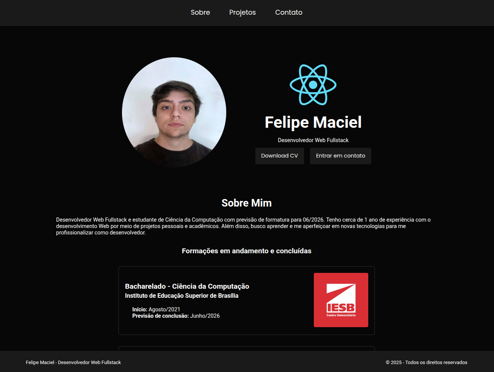

<h1 align = "center">
  
</h1>

## Sobre o projeto

O projeto do meu site pessoal é uma aplicação Web desenvolvida com ReactJS e TypeScript para exibir minhas informações pessoais/profissionais e meu portifólio de projetos, além de meios de contato. O sistema desenvolvido conta com telas responsivas a aparelhos mobile e desktop para melhor experiência do usuário.

## Como utilizar o projeto

### Link do deploy da aplicação

https://siterocketnotess.netlify.app/
 
### Executando o Frontend do projeto

```bash

  # Vá até o diretório do projeto
  $ cd site-pessoal

  # Instale a dependência node_modules
  $ npm install

  # Inicie o servidor 
  $ npm run dev

  # Agora, basta executar cntrl + click no endereço exibido no terminal ou digitar no seu navegador de preferência:
  $ http://localhost:5173/

```

## Tecnologias utilizadas

A parte Frontend do projeto foi desenvolvida com a utilização das seguintes tecnologias:

- [ReactJS](https://react.dev/)
- [TypeScript](https://www.typescriptlang.org/)
- [ReactDOM](https://www.npmjs.com/package/react-dom)
- [React Icons](https://react-icons.github.io/react-icons/)
- [Styled Components](https://styled-components.com/)

### - ReactJS 

Biblioteca JavaScript voltada ao frontend e amplamente utilizada para o desenvolvimento de interfaces de usuário (UIs).

### - TypeScript

Linguagem de programação que funciona como um superconjunto de JavaScript, adicionando recursos como tipagem estática, interfaces, classes e outros recursos da orientação a objetos. Desenvolvida e mantida pela Microsoft, é voltada ao desenvolvimento de aplicações web e mobile.

### - ReactDOM

Responsável por renderizar componentes ou elementos React na DOM.

### - React Icons

Bibioteca React utilizada para adicionar ícones a botões no geral.

### - Styled Components

Biblioteca React que possibilita o uso do CSS-in-JS para estilização de componentes e páginas React.